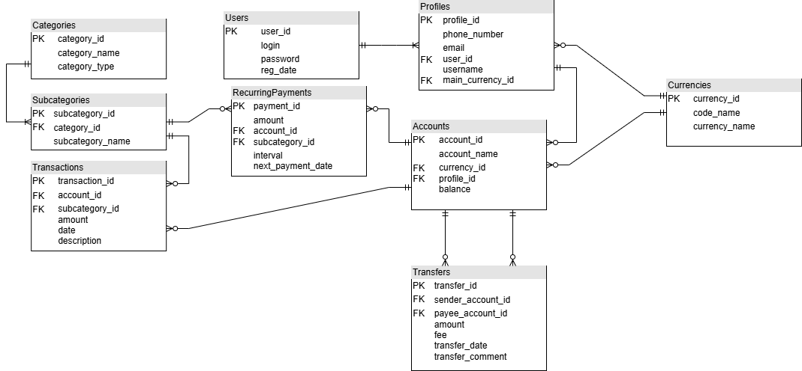

# Лабораторна робота 1: Збір вимог та розробка схеми ER
### Тема: 
Розроблення бази даних для застосунку моніторингу та керування особистих фінансів.
### Мета:
Мета бази заключається у зберіганні інформації від особистих даних до рахунків та транзакцій.
Додатково можливості банкінгового застосунку.
***
### Потреби зацікавлених сторін:
- Можливість мати декілька профілів або рахунків для зберігання як державної та і іноземної валюти.
- Керування фінансами із застосунку *(не в плані моніторингу)*.
- Керування підписками *(регулярні платежі)*.
- Моніторинг витрат/доходів.
- Можливість перегляду транзакцій за категоріями/підкатегоріями.
- Перегляд курсу основних іноземних валют.
### Дані для зберігання:
- Користувачі та усі можливі профілі.
- Рахунки користувачів, включаючи валютні.
- Транзакції та перекази по рахункам.
- Різні валюти.
- Регулярні платежі.
- Категорії та підкатегорії.
### Бізнес-правила:
*Поки не знаю, що написати*
***
### Зображення діаграми ER:

***
### Список сутностей з їхніми атрибутами та пояснення кожного зв'язку прозою:
1. **Users**
   - `user_id` - унікальний ідентифікатор користувача, є первинним ключем.
   - `login` - логін користувача.
   - `password` - пароль користувача.
   - `reg_date` - дата рєстрації користувача.
     
   Зв'язки:
   - Користувач може мати декілька профілів.
   - Профіль може належати лише одному користувачу.
   - Користувач має хоча б один профіль.

2. **Profiles**
   - `profile_id` - унікальний ідентифікатор користувача, є первинним ключем.
   - `phone_number` - номер телефону, що прив'язаний до профілю.
   - `email` - електронна пошта, що прив'язана до профілю.
   - `user_id` - ідентифікатор користувача, якому належить профіль.
   - `username` - ім'я профілю.
   - `main_currency_id` - основна валюта профілю.

   Зв'язки:
   - Профіль може належати лише одному користувачу.
   - Основна валюта профілю може бути лише одна.
   - Одному профілю може належати декілька рахунків.
   - Рахунок може належати лише одному профілю.
   - Профіль може не мати рахунків.

3. **Currencies**
   - `currency_id` - унікальний ідентифікатор валюти, є первинним ключем.
   - `code_name` - кодова назва валюти *(UAH, USD, EUR)*.
   - `currency_name` - назва валюти *(Гривня, Долар, Євро)*.
   
   Зв'язки:
   - Одна валюта може використовуватись у багатьох профілях.
   - Одна валюта може використовуватись у багатьох рахунках.
   - Валюта може не використовуватись ніде.

4. **Accounts**
   - `account_id` - унікальний ідентифікатор рахунку, є первинним ключем.
   - `account_name` - назва рахунку *(В нашому випадку це назва картки або "Готівка")*.
   - `currency_id` - ідентифікатор валюти.
   - `profile_id` - ідентифікатор профілю.
   - `balance` - баланс рахунку.
  
   Зв'язки:
   - Рахунок може належати лише одному профілю.
   - Рахунок може використовувати лише одну валюту.
   - Один рахунок може мати регулярний платіж.
   - Рахунок може не мати регулярний платіж.
   - У рахунку можуть бути транзакції *(декілька)*.
   - У рахунку можуть не бути транзакції.
   - Рахунок може бути у декількох переказах у ролі як відправника так і отримувача.
   - Рахунок може не бути у переказах у ролі як відправника так і отримувача.

5. **Transfers**
   - `transfer_id` - унікальний ідентифікатор переказу, є первинним ключем.
   - `sender_account_id` - ідентифікатор відправника переказу.
   - `payye_account_id` - ідентифікатор отримувача переказу.
   - `amount` - сума.
   - `fee` - комісія.
   - `transfer_date` - дата здійснення переказу.
   - `transfer_comment` - коментар до переказу.

   Зв'язки:
   - У одного переказу може бути лише один рахунок-відправник і один рахунок-отримувач.
   - Один рахунок може мати декілька переказів, а може не мати взагалі.

6. **RecurringPayments**
   - `payment_id` - унікальний ідентифікатор регулярного платежу, є первинним ключем.
   - `amount` - сума.
   - `account_id` - ідентифікатор рахунку, якому цей платіж належить.
   - `subcategory_id` - підкатегорія платежу *(включає в себе категорію)*.
   - `interval` - інтервал списання коштів.
   - `next_payment_date` - дата наступного платежу.
  
   Зв'язки:
   - Платіж може належати лише одному рахунку.
   - У одного рахунку може бути декілька платежів.
   - Один платіж може бути лише однієї підкатегорії/категорії.
   - Одна категорія може належати декільком платежам.

7. **Transactions**
   - `transaction_id` - унікальний ідентифікатор транзакції, є первинним ключем.
   - `account_id` - ідентифікатор рахунку.
   - `subcategory_id` - ідентифікатор підкатегорії.
   - `amount` - сума.
   - `date` - дата здійснення транзакції.
   - `description` - опис до транзакції.
  
   Зв'язки:
   - Транзакція може належати лише одному рахунку.
   - Один рахунок може мати декілька транзакцій, а може не мати взагалі.
   - Транзакція може бути лише однієї підкатегорії/категорії.
   - Одна підкатегорія може мати багато транзакцій.

8. **Categories**
   - `category_id` - унікальний ідентифікатор категорії, є первинним ключем.
   - `category_name` - назва категорії.
   - `category_type` - тип категорії *(витрата/дохід)*.

   Зв'язки:
   - Категорія може містити декілька та повинна містити хоча б одну підкатегорію.
   - Підкатегорія може належати лише одній категорії.

9. **Subcategories**
   - `subcategory_id` - унікальний ідентифікатор підкатегорії, є первинним ключем.
   - `category_id` - ідентифікатор категорії.
   - `subcategory_name` - назва підкатегорії.
  
   Зв'язки:
   
