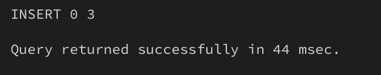
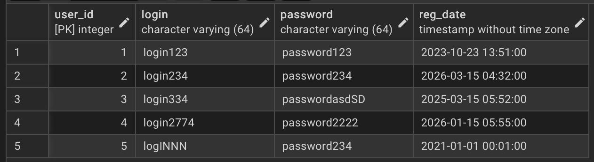
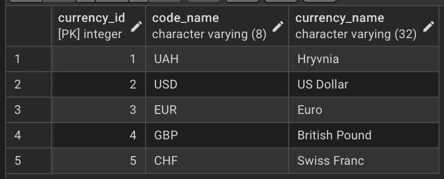
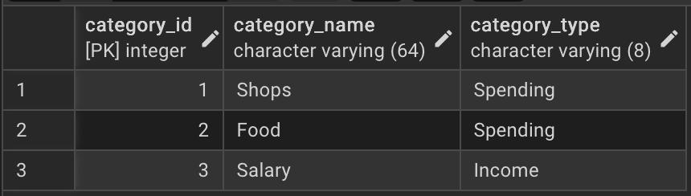
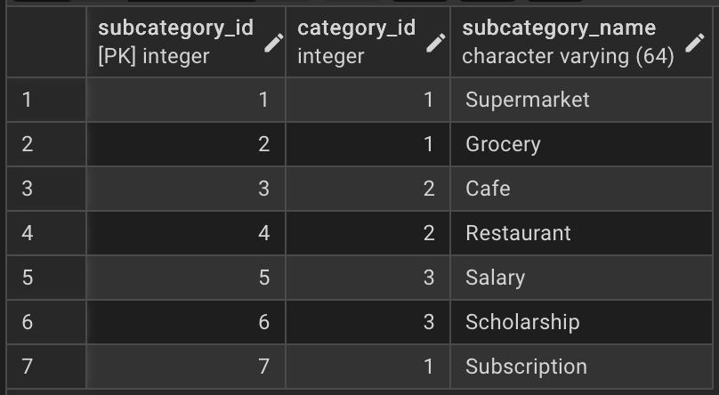
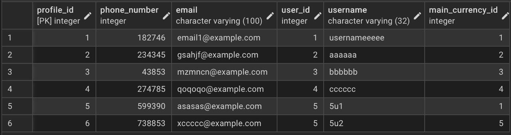
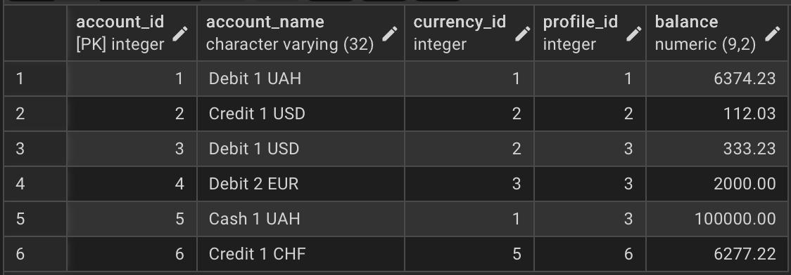
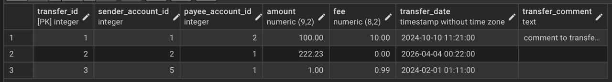
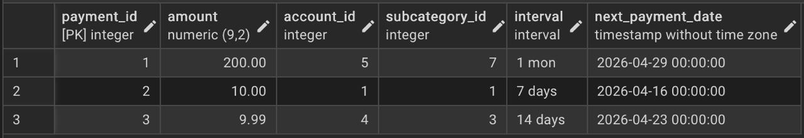
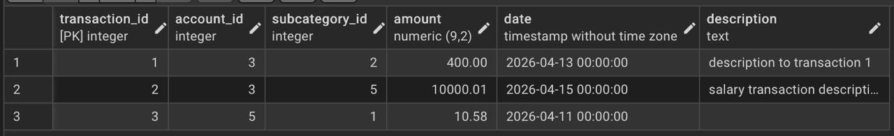

# Лабораторна робота 2: Перетворення ER-діаграми на схему PostgreSQL
## Цілі:
1. Написати SQL DDL-інструкції для створення кожної таблиці з вашої ERD в PostgreSQL.
2. Вказати відповідні типи даних для кожного стовпця, вибрати первинний ключ для кожної таблиці та визначити будь-які необхідні зовнішні ключі, обмеження UNIQUE, NOT NULL, CHECK або DEFAULT.
3. Вставити зразки рядків (принаймні 3–5 рядків на таблицю) за допомогою INSERT INTO.
4. Протестувати все в pgAdmin (або іншому клієнті PostgreSQL), щоб переконатися, що таблиці та дані завантажуються правильно.
***
## Результат:
### 1. SQL DDL-інструкції для створення таблиць. + 2. Вказані відповідні типи даних для кожного стовпця, вибрати первинні ключі та зовнішні ключі, обмеження.
```sql
CREATE TABLE Users (
	user_id SERIAL PRIMARY KEY,
	login VARCHAR(64) NOT NULL CHECK (login ~ '^[a-zA-Z0-9]+$'),
	"password" VARCHAR(64) NOT NULL,
	reg_date TIMESTAMP NOT NULL
);

CREATE TABLE Currencies (
	currency_id SERIAL PRIMARY KEY,
	code_name VARCHAR(8) NOT NULL,
	currency_name VARCHAR(32) NOT NULL
);

CREATE TABLE Categories (
	category_id SERIAL PRIMARY KEY,
	category_name VARCHAR(64) NOT NULL,
	category_type VARCHAR(8) NOT NULL
);

CREATE TABLE Subcategories (
	subcategory_id SERIAL PRIMARY KEY,
	category_id INTEGER REFERENCES Categories(category_id),
	subcategory_name VARCHAR(64) NOT NULL
);

CREATE TABLE Profiles (
	profile_id SERIAL PRIMARY KEY,
	phone_number INTEGER,
	email VARCHAR(100),
	user_id INTEGER REFERENCES Users(user_id),
	username VARCHAR(32) NOT NULL,
	main_currency_id INTEGER REFERENCES Currencies(currency_id)
);

CREATE TABLE Accounts (
	account_id SERIAL PRIMARY KEY,
	account_name VARCHAR(32) NOT NULL,
	currency_id INTEGER REFERENCES Currencies(currency_id),
	profile_id INTEGER REFERENCES Profiles(profile_id),
	balance NUMERIC(9,2) CHECK(balance >=0)
);

CREATE TABLE Transfers (
	transfer_id SERIAL PRIMARY KEY,
	sender_account_id INTEGER REFERENCES Accounts(account_id),
	payee_account_id INTEGER REFERENCES Accounts(account_id),
	amount NUMERIC(9,2) NOT NULL CHECK(amount>0),
	fee NUMERIC(8,2),
	transfer_date TIMESTAMP NOT NULL,
	transfer_comment TEXT
);

CREATE TABLE RecurringPayments (
	payment_id SERIAL PRIMARY KEY,
	amount NUMERIC(9,2) NOT NULL CHECK(amount>0),
	account_id INTEGER REFERENCES Accounts(account_id),
	subcategory_id INTEGER REFERENCES Subcategories(subcategory_id),
	"interval" INTERVAL NOT NULL CHECK("interval">INTERVAL '1 second'),
	next_payment_date TIMESTAMP NOT NULL
);

CREATE TABLE Transactions (
	transaction_id SERIAL PRIMARY KEY,
	account_id INTEGER REFERENCES Accounts(account_id),
	subcategory_id INTEGER REFERENCES Subcategories(subcategory_id),
	amount NUMERIC(9,2) NOT NULL CHECK(amount>0),
	"date" TIMESTAMP NOT NULL,
	description TEXT
);
```
> **_Опис стовпців та ключів:_**
>
> **Users**
> 
> - `user_id` - *SERIAL PRIMARY KEY,* серійний(тобто йде по порядку) первинний ключ для ідентифікатору користувача, не може не існувати.
> - `login` - *VARCHAR(64),* короткий текст на 64 символи для логіну користувача, неможна вводити спецсимволи, не може не існувати.
> - `password` - *VARCHAR(64),* короткий текст на 64 символи для паролю користувача, не може не існувати.
> - `reg_date` - *TIMESTAMP,* дата + час реєстрації у форматі `yyyy-mm-dd hh:mm` без урахування часового поясу, не може не існувати.
>
> **Currencies**
>
> - `currency_id` - *SERIAL PRIMARY KEY,* серійний(тобто йде по порядку) первинний ключ для ідентифікатору валюти, не може не існувати.
> - `code_name` - *VARCHAR(8),* короткий текст на 8 символів для коду валюти типу `USD`, `UAH`, `EUR`, не може не уснувати.
> - `currency_name` - *VARCHAR(32),* короткий текст на 32 символи для назви валюти, не може не існувати.
>
> **Categories**
>
> - `category_id` - *SERIAL PRIMARY KEY,* серійний(тобто йде по порядку) первинний ключ для ідентифікатору категорії, не може не існувати.
> - `category_name` - *VARCHAR(64),* короткий текст на 32 символи для назви категорії, не може не існувати.
> - `category_type` - *VARCHAR(8),* короткий текст на 8 симвлів для позначення типу категорії *(витрата чи дохід)*.
>
> **Subcategories**
>
> - `subcategory_id` - *SERIAL PRIMARY KEY,* серійний(тобто йде по порядку) первинний ключ для ідентифікатору підкатегорії, не може не існувати.
> - `category_id` - *INTEGER,* ціле число, ідентифікатор категорії, посилається на `Categories(categoty_id)`, не може не існувати.
> - `subcategory_name` - *VARCHAR(64),* короткий текст на 64 символи для назви підкатегорії, не може не існувати.
>
> **Profiles**
>
> - `profile_id` - *SERIAL PRIMARY KEY,* серійний(тобто йде по порядку) первинний ключ для ідентифікатору профіля, не може не існувати.
> - `phone_number` - *INTEGER,* ціле число, номер телефону для профіля.
> - `email` - *VARCHAR(100),* короткий текст на 100 символів для електронної пошти профіля.
> - `user_id` - *INTEGER,* ціле число, ідентифікатор користувача, посилається на `Users(user_id)`, не може не існувати.
> - `username` - *VARCHAR(32),* короткий текст для імені профіля/нікнейму, не може не існувати.
> - `main_currency_id` - *INTEGER,* ціле число, ідентифікатор валюти, посилається на `Currencies(currency_id)`, не може не існувати.
>
> **Accounts**
>
> - `account_id` - *SERIAL PRIMARY KEY,* серійний(тобто йде по порядку) первинний ключ для ідентифікатору рахунку, не може не існувати.
> - `account_name` - *VARCHAR(32),* короткий текст на 32 символи для назви рахунку, не може не існувати.
> - `currency_id` - *INTEGER,* ціле число, ідентифікатор валюти, посилається на `Currencies(currency_id)`, не може не існувати.
> - `profile_id` - *INTEGER,* ціле число, ідентифікатор профілю, посилається на `Profiles(profile_id)`, не може не існувати.
> - `balance` - *NUMERIC(9,2),* не ціле число, баланс рахунку, діапазон від -9,999,999.99 до 9,999,999.99 *(Тобто 9 можливих цифр, 2 з яких після крапки, тобто копійки),* баланс не може бути відʼємним.
>
> **Transfers**
>
> - `transfer_id` - *SERIAL PRIMARY KEY,* серійний(тобто йде по порядку) первинний ключ для ідентифікатору переказу, не може не існувати.
> - `sender_account_id` - *INTEGER,* ціле число, ідентифікатор рахунку відправника, посилається на `Accounts(account_id)`, не може не існувати.
> - `payee_account_id` - *INTEGER,* ціле число, ідентифікатор рахунку отримувача, посилається на `Accounts(account_id)`, не може не існувати.
> - `amount` - *NUMERIC(9,2),* не ціле число, сума переказу, діапазон від -9,999,999.99 до 9,999,999.99 *(Тобто 9 можливих цифр, 2 з яких після крапки, тобто копійки),* не може не існувати, сума повинна бути більше нуля.
> - `fee` -  *NUMERIC(8,2),* не ціле число, комісія за переказ, діапазон від -999,999.99 до 999,999.99 *(Тобто 8 можливих цифр, 2 з яких після крапки, тобто копійки)*.
> - `transfer_date` - *TIMESTAMP,* дата + час переказу у форматі `yyyy-mm-dd hh:mm` без урахування часового поясу, не може не існувати.
> - `transfer_comment` - *TEXT,* довгий текст коментаря до переказу.
>
> **RecurringPayments**
>
> - `payment_id` - *SERIAL PRIMARY KEY,* серійний(тобто йде по порядку) первинний ключ для ідентифікатору регулярного платежу, не може не існувати.
> - `amount` - *NUMERIC(9,2),* не ціле число, сума платежу, діапазон від -9,999,999.99 до 9,999,999.99 *(Тобто 9 можливих цифр, 2 з яких після крапки, тобто копійки),* не може не існувати, сума повинна бути більше нуля.
> - `account_id` - *INTEGER,* ціле число, ідентифікатор рахунку, посилається на `Accounts(account_id)`, не може не існувати.
> - `subcategory_id` - *INTEGER,* ціле число, ідентифікатор підкатегорії, посилається на `Subcategories(subcategoty_id)`, не може не існувати.
> - `interval` - *INTERVAL,* інтервал платежу, не може не існувати, інтервал повинен бути більше однієї секунди.
> - `next_payment_date` - *TIMESTAMP,* дата + час платежу у форматі `yyyy-mm-dd hh:mm` без урахування часового поясу, не може не існувати.
>
> **Transactions**
>
> - `transaction_id` - *SERIAL PRIMARY KEY,* серійний(тобто йде по порядку) первинний ключ для ідентифікатору транзакції, не може не існувати.
> - `account_id` - *INTEGER,* ціле число, ідентифікатор рахунку, посилається на `Accounts(account_id)`, не може не існувати.
> - `subcategory_id` - *INTEGER,* ціле число, ідентифікатор підкатегорії, посилається на `Subcategories(subcategoty_id)`, не може не існувати.
> - `amount` - *NUMERIC(9,2),* не ціле число, сума транзакції, діапазон від -9,999,999.99 до 9,999,999.99 *(Тобто 9 можливих цифр, 2 з яких після крапки, тобто копійки),* не може не існувати, сума повинна бути більше нуля.
> - `date` - *TIMESTAMP,* дата + час транзакції у форматі `yyyy-mm-dd hh:mm` без урахування часового поясу, не може не існувати.
> - `description` - *TEXT*, довгий текст опису/коментаря до транзакції.

### Результат створення таблиць:
i. 
ii. 
***
### 3. Вставити зразки рядків (принаймні 3–5 рядків на таблицю) за допомогою `INSERT INTO`.
```sql
INSERT INTO Users (user_id, login, "password", reg_date) VALUES
	(1,'login123','password123','2023-10-23 13:51'),
	(2,'login234','password234','2026-3-15 04:32'),
	(3,'login334','passwordasdSD','2025-3-15 05:52'),
	(4,'login2774','password2222','2026-1-15 05:55'),
	(5,'logINNN','password234','2021-1-1 00:01');

INSERT INTO Currencies (currency_id, code_name, currency_name) VALUES
	(1,'UAH','Hryvnia'),
	(2,'USD','US Dollar'),
	(3,'EUR','Euro'),
	(4,'GBP','British Pound'),
	(5,'CHF','Swiss Franc');

INSERT INTO Categories (category_id, category_name, category_type) VALUES
	(1,'Shops','Spending'),
	(2,'Food','Spending'),
	(3,'Salary','Income');

INSERT INTO Subcategories (subcategory_id, category_id, subcategory_name) VALUES
	(1,1,'Supermarket'),
	(2,1,'Grocery'),
	(3,2,'Cafe'),
	(4,2,'Restaurant'),
	(5,3,'Salary'),
	(6,3,'Scholarship'),
	(7,1,'Subscription');

INSERT INTO Profiles (profile_id, phone_number, email, user_id, username, main_currency_id) VALUES
	(1,182746,'email1@example.com',1,'usernameeeee',1),
	(2,234345,'gsahjf@example.com',2,'aaaaaa',2),
	(3,043853,'mzmncn@example.com',3,'bbbbbb',3),
	(4,274785,'qoqoqo@example.com',4,'cccccc',4),
	(5,599390,'asasas@example.com',5,'5u1',1),
	(6,738853,'xccccc@example.com',5,'5u2',5);

INSERT INTO Accounts (account_id, account_name, currency_id, profile_id, balance) VALUES
	(1,'Debit 1 UAH',1,1,6374.23),
	(2,'Credit 1 USD',2,2,112.03),
	(3,'Debit 1 USD',2,3,333.23),
	(4,'Debit 2 EUR',3,3,2000.00),
	(5,'Cash 1 UAH',1,3,100000.00),
	(6,'Credit 1 CHF',5,6,6277.22);

INSERT INTO Transfers (transfer_id, sender_account_id, payee_account_id, amount, fee, transfer_date, transfer_comment) VALUES
	(1,1,2,100.00,10.00,'2024-10-10 11:21','comment to transfer 1'),
	(2,2,1,222.23,0.00,'2026-4-4 00:22',''),
	(3,5,1,1.00,0.99,'2024-2-1 01:11','');

INSERT INTO RecurringPayments (payment_id, amount, account_id, subcategory_id, "interval", next_payment_date) VALUES
	(1,200.00,5,7,'1 month','2026-4-29'),
	(2,10.00,1,1,'1 week','2026-4-16'),
	(3,9.99,4,3,'2 week','2026-4-23');

INSERT INTO Transactions (transaction_id, account_id, subcategory_id, amount, "date", description) VALUES
	(1,3,2,400.00,'2026-4-13','description to transaction 1'),
	(2,3,5,10000.01,'2026-4-15','salary transaction description'),
	(3,5,1,10.58,'2026-4-11','');
```
### Результат вставлення:

***
### 4. Протестувати все в pgAdmin (або іншому клієнті PostgreSQL), щоб переконатися, що таблиці та дані завантажуються правильно.
#### Users:

#### Currencies:

#### Categories:

#### Subcategories:

#### Profiles:

#### Accounts:

#### Transfers:

#### RecurringPayments:

#### Transactions:



