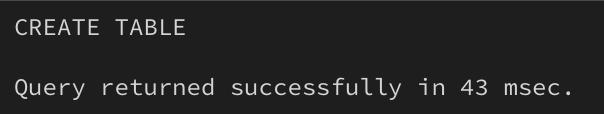
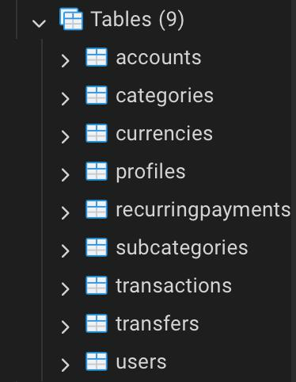

# Лабораторна робота 2: Перетворення ER-діаграми на схему PostgreSQL
## Цілі:
1. Написати SQL DDL-інструкції для створення кожної таблиці з вашої ERD в PostgreSQL.
2. Вказати відповідні типи даних для кожного стовпця, вибрати первинний ключ для кожної таблиці та визначити будь-які необхідні зовнішні ключі, обмеження UNIQUE, NOT NULL, CHECK або DEFAULT.
3. Вставити зразки рядків (принаймні 3–5 рядків на таблицю) за допомогою INSERT INTO.
4. Протестувати все в pgAdmin (або іншому клієнті PostgreSQL), щоб переконатися, що таблиці та дані завантажуються правильно.
## Результат:
### 1. SQL DDL-інструкції для створення таблиць. + 2. Вказані відповідні типи даних для кожного стовпця, вибрати первинні ключі та зовнішні ключі, обмеження.
```sql
CREATE TABLE Users (
	user_id SERIAL PRIMARY KEY,
	login VARCHAR(64) NOT NULL CHECK (login ~ '^[a-zA-Z0-9]+$'),
	"password" VARCHAR(64) NOT NULL,
	reg_date TIMESTAMP NOT NULL
);

CREATE TABLE Currencies (
	currency_id SERIAL PRIMARY KEY,
	code_name VARCHAR(8) NOT NULL,
	currency_name VARCHAR(32) NOT NULL
);

CREATE TABLE Categories (
	category_id SERIAL PRIMARY KEY,
	category_name VARCHAR(64) NOT NULL,
	category_type VARCHAR(8) NOT NULL
);

CREATE TABLE Subcategories (
	subcategory_id SERIAL PRIMARY KEY,
	category_id INTEGER REFERENCES Categories(category_id),
	subcategory_name VARCHAR(64) NOT NULL
);

CREATE TABLE Profiles (
	profile_id SERIAL PRIMARY KEY,
	phone_number INTEGER,
	email VARCHAR(100),
	user_id INTEGER REFERENCES Users(user_id),
	username VARCHAR(32) NOT NULL,
	main_currency_id INTEGER REFERENCES Currencies(currency_id)
);

CREATE TABLE Accounts (
	account_id SERIAL PRIMARY KEY,
	account_name VARCHAR(32) NOT NULL,
	currency_id INTEGER REFERENCES Currencies(currency_id),
	profile_id INTEGER REFERENCES Profiles(profile_id),
	balance NUMERIC(9,2) CHECK(balance >=0)
);

CREATE TABLE Transfers (
	transfer_id SERIAL PRIMARY KEY,
	sender_account_id INTEGER REFERENCES Accounts(account_id),
	payee_account_id INTEGER REFERENCES Accounts(account_id),
	amount NUMERIC(9,2) NOT NULL CHECK(amount>0),
	fee NUMERIC(8,2),
	transfer_date TIMESTAMP NOT NULL,
	transfer_comment TEXT
);

CREATE TABLE RecurringPayments (
	payment_id SERIAL PRIMARY KEY,
	amount NUMERIC(9,2) NOT NULL CHECK(amount>0),
	account_id INTEGER REFERENCES Accounts(account_id),
	subcategory_id INTEGER REFERENCES Subcategories(subcategory_id),
	"interval" INTERVAL NOT NULL CHECK("interval">INTERVAL '1 second'),
	next_payment_date TIMESTAMP NOT NULL
);

CREATE TABLE Transactions (
	transaction_id SERIAL PRIMARY KEY,
	account_id INTEGER REFERENCES Accounts(account_id),
	subcategory_id INTEGER REFERENCES Subcategories(subcategory_id),
	amount NUMERIC(9,2) NOT NULL CHECK(amount>0),
	"date" TIMESTAMP NOT NULL,
	description TEXT
);
```
> **_Опис стовпців та ключів:_**
>
> **Users**
> 
> - `user_id` - *SERIAL PRIMARY KEY,* серійний(тобто йде по порядку) первинний ключ для ідентифікатору користувача, не може не існувати.
> - `login` - *VARCHAR(64),* короткий текст на 64 символи для логіну користувача, неможна вводити спецсимволи, не може не існувати.
> - `password` - *VARCHAR(64),* короткий текст на 64 символи для паролю користувача, не може не існувати.
> - `reg_date` - *TIMESTAMP,* дата + час реєстрації у форматі `yyyy-mm-dd hh:mm` без урахування часового поясу, не може не існувати.
>
> **Currencies**
>
> - `currency_id` - *SERIAL PRIMARY KEY,* серійний(тобто йде по порядку) первинний ключ для ідентифікатору валюти, не може не існувати.
> - `code_name` - *VARCHAR(8),* короткий текст на 8 символів для коду валюти типу `USD`, `UAH`, `EUR`, не може не уснувати.
> - `currency_name` - *VARCHAR(32),* короткий текст на 32 символи для назви валюти, не може не існувати.
>
> **Categories**
>
> - `category_id` - *SERIAL PRIMARY KEY,* серійний(тобто йде по порядку) первинний ключ для ідентифікатору категорії, не може не існувати.
> - `category_name` - *VARCHAR(64),* короткий текст на 32 символи для назви категорії, не може не існувати.
> - `category_type` - *VARCHAR(8),* короткий текст на 8 симвлів для позначення типу категорії *(витрата чи дохід)*.
>
> **Subcategories**
>
> - `subcategory_id` - *SERIAL PRIMARY KEY,* серійний(тобто йде по порядку) первинний ключ для ідентифікатору підкатегорії, не може не існувати.
> - `category_id` - *INTEGER,* ціле число, ідентифікатор категорії, посилається на `Categories(categoty_id)`, не може не існувати.
> - `subcategory_name` - *VARCHAR(64),* короткий текст на 64 символи для назви підкатегорії, не може не існувати.
>
> **Profiles**
>
> - `profile_id` - *SERIAL PRIMARY KEY,* серійний(тобто йде по порядку) первинний ключ для ідентифікатору профіля, не може не існувати.
> - `phone_number` - *INTEGER,* ціле число, номер телефону для профіля.
> - `email` - *VARCHAR(100),* короткий текст на 100 символів для електронної пошти профіля.
> - `user_id` - *INTEGER,* ціле число, ідентифікатор користувача, посилається на `Users(user_id)`, не може не існувати.
> - `username` - *VARCHAR(32),* короткий текст для імені профіля/нікнейму, не може не існувати.
> - `main_currency_id` - *INTEGER,* ціле число, ідентифікатор валюти, посилається на `Currencies(currency_id)`, не може не існувати.
>
> **Accounts**
>
> - `account_id` - *SERIAL PRIMARY KEY,* серійний(тобто йде по порядку) первинний ключ для ідентифікатору рахунку, не може не існувати.
> - `account_name` - *VARCHAR(32),* короткий текст на 32 символи для назви рахунку, не може не існувати.
> - `currency_id` - *INTEGER,* ціле число, ідентифікатор валюти, посилається на `Currencies(currency_id)`, не може не існувати.
> - `profile_id` - *INTEGER,* ціле число, ідентифікатор профілю, посилається на `Profiles(profile_id)`, не може не існувати.
> - `balance` - *NUMERIC(9,2),* не ціле число, баланс рахунку, діапазон від -9,999,999.99 до 9,999,999.99 *(Тобто 9 можливих цифр, 2 з яких після крапки, тобто копійки),* баланс не може бути відʼємним.
>
> **Transfers**
>
> - `transfer_id` - *SERIAL PRIMARY KEY,* серійний(тобто йде по порядку) первинний ключ для ідентифікатору переказу, не може не існувати.
> - `sender_account_id` - *INTEGER,* ціле число, ідентифікатор рахунку відправника, посилається на `Accounts(account_id)`, не може не існувати.
> - `payee_account_id` - *INTEGER,* ціле число, ідентифікатор рахунку отримувача, посилається на `Accounts(account_id)`, не може не існувати.
> - `amount` - *NUMERIC(9,2),* не ціле число, сума переказу, діапазон від -9,999,999.99 до 9,999,999.99 *(Тобто 9 можливих цифр, 2 з яких після крапки, тобто копійки),* не може не існувати, сума повинна бути більше нуля.
> - `fee` -  *NUMERIC(8,2),* не ціле число, комісія за переказ, діапазон від -999,999.99 до 999,999.99 *(Тобто 8 можливих цифр, 2 з яких після крапки, тобто копійки)*.
> - `transfer_date` - *TIMESTAMP,* дата + час переказу у форматі `yyyy-mm-dd hh:mm` без урахування часового поясу, не може не існувати.
> - `transfer_comment` - *TEXT,* довгий текст коментаря до переказу.
>
> **RecurringPayments**
>
> - `payment_id` - *SERIAL PRIMARY KEY,* серійний(тобто йде по порядку) первинний ключ для ідентифікатору регулярного платежу, не може не існувати.
> - `amount` - *NUMERIC(9,2),* не ціле число, сума платежу, діапазон від -9,999,999.99 до 9,999,999.99 *(Тобто 9 можливих цифр, 2 з яких після крапки, тобто копійки),* не може не існувати, сума повинна бути більше нуля.
> - `account_id` - *INTEGER,* ціле число, ідентифікатор рахунку, посилається на `Accounts(account_id)`, не може не існувати.
> - `subcategory_id` - *INTEGER,* ціле число, ідентифікатор підкатегорії, посилається на `Subcategories(subcategoty_id)`, не може не існувати.
> - `interval` - *INTERVAL,* інтервал платежу, не може не існувати, інтервал повинен бути більше однієї секунди.
> - `next_payment_date` - *TIMESTAMP,* дата + час платежу у форматі `yyyy-mm-dd hh:mm` без урахування часового поясу, не може не існувати.
>
> **Transactions**
>
> - `transaction_id` - *SERIAL PRIMARY KEY,* серійний(тобто йде по порядку) первинний ключ для ідентифікатору транзакції, не може не існувати.
> - `account_id` - *INTEGER,* ціле число, ідентифікатор рахунку, посилається на `Accounts(account_id)`, не може не існувати.
> - `subcategory_id` - *INTEGER,* ціле число, ідентифікатор підкатегорії, посилається на `Subcategories(subcategoty_id)`, не може не існувати.
> - `amount` - *NUMERIC(9,2),* не ціле число, сума транзакції, діапазон від -9,999,999.99 до 9,999,999.99 *(Тобто 9 можливих цифр, 2 з яких після крапки, тобто копійки),* не може не існувати, сума повинна бути більше нуля.
> - `date` - *TIMESTAMP,* дата + час транзакції у форматі `yyyy-mm-dd hh:mm` без урахування часового поясу, не може не існувати.
> - `description` - *TEXT*, довгий текст опису/коментаря до транзакції.

### Результат створення таблиць:
1. 
2. 


