# Лабораторна робота 3: Маніпулювання даними SQL (OLTP)
## Цілі:
1. Написати запити `SELECT` для отримання даних (включаючи фільтрацію за допомогою `WHERE` та вибір певних стовпців).
2. Практикувати використання операторів `INSERT` для додавання нових рядків до таблиць.
3. Практикувати використання оператора `UPDATE` для зміни існуючих рядків (використовуючи `SET` та `WHERE`).
4. Практикувати використання операторів `DELETE` для безпечного видалення рядків (за допомогою `WHERE`).
5. Вивчити основні операції маніпулювання даними (DML) у PostgreSQL та спостерігати за їхнім впливом.
***
## 1. Написати запити `SELECT` для отримання даних (включаючи фільтрацію за допомогою `WHERE` та вибір певних стовпців).
### Отримання логіну та паролю користувачів, що були зареєстровані після 1 січня 2026 року:
```sql
SELECT login, "password" FROM Users WHERE reg_date > '2026-1-1';
```
### Результат:
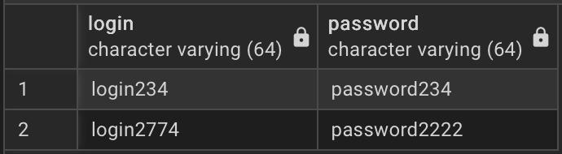

### Вивід кодових назв валют типу `USD`, у яких реальна назва англійською більше 7 літер.
```sql
SELECT code_name FROM Currencies WHERE LENGTH(currency_name) > 7;
```
### Результат:
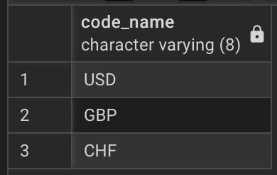

### Вивід категорій, типи яких відносяться до витрат.
```sql
SELECT category_name FROM Categories WHERE category_type = 'Spending';
```
### Результат:
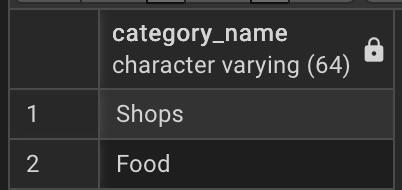

### Вивід підкатегорій, що відносяться до категорії магазину.
```sql
SELECT subcategory_name FROM Subcategories WHERE category_id = 1;
```
### Результат:
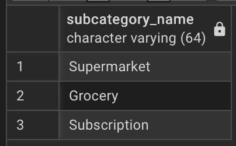

### Вивід ідентифікатора, пошти та нікнейма профілів, номер яких кратний 3 і 5, з будь-якою валютою окрім фунтів.
```sql
SELECT user_id, email, username FROM Profiles WHERE phone_number % 3 = 0 AND phone_number % 5 = 0 AND main_currency_id != 4;
```
### Результат:
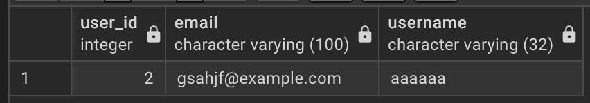

### Вивід ідентифікаторів та назв рахунків з балансом хочаб 2000 *(без врахування валюти)*.
```sql
SELECT account_id, account_name FROM Accounts WHERE balance >= 2000;
```
### Результат:
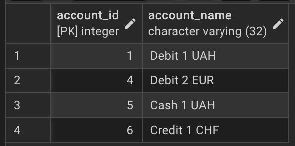

### Вивід на яку суму та коли були здійснені перекази з яких була стягнута комісія.
```sql
SELECT amount, transfer_date FROM Transfers WHERE fee > 0;
```
### Результат:
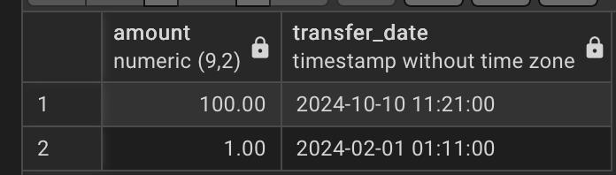

### Вивід на яку суму оформлені регулярні платежі з інтервалом оплати менше місяця.
```sql
SELECT amount FROM RecurringPayments WHERE "interval" < '1 month';
```
### Результат:
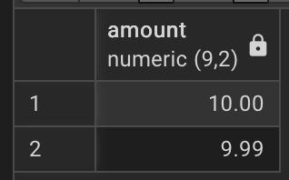

### Вивід дати коли були виконані транзакції, до яких не було додано опису.
```sql
SELECT "date" FROM Transactions WHERE description != '';
```
### Результат:
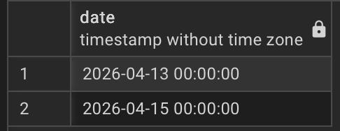

***

## 2. Практикувати використання операторів `INSERT` для додавання нових рядків до таблиць.
### Додання нового користувача.
```sql
INSERT INTO Users (user_id, login, "password", reg_date)
VALUES (6, 'newLoginLab3', 'passwordnewinsertion', NOW());

SELECT * FROM Users
```
### Результат:
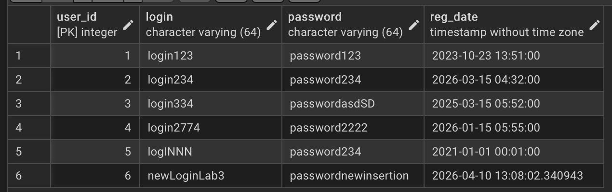

### Додання нової валюти.
```sql
INSERT INTO Currencies (currency_id, code_name, currency_name)
VALUES (6, 'BTC', 'Bitcoin');

SELECT * FROM Currencies
```
### Результат:
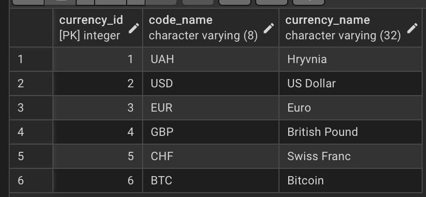

### Додання нової категорії.
```sql
INSERT INTO Categories (category_id, category_name, category_type)
VALUES (4, 'example category', 'Income');

SELECT * FROM Categories
```
### Результат:
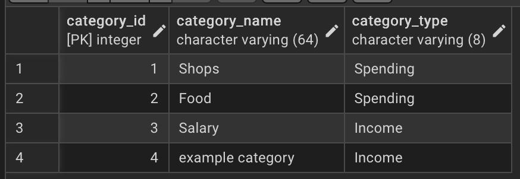

### Додання нової підкатегорії.
```sql
INSERT INTO Subcategories (subcategory_id, category_id, subcategory_name)
VALUES (8,2,'example subcategory');

SELECT * FROM Subcategories
```
### Результат:
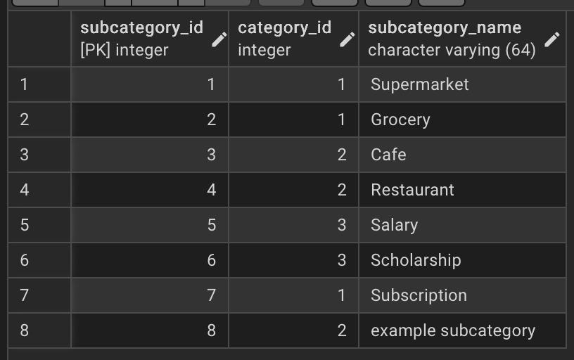

### Додання нового профілю.
```sql
INSERT INTO Profiles (profile_id, phone_number, email, user_id, username, main_currency_id)
VALUES (7,435454446,'example@exampleexample.com',1,'usernameforexample',1);

SELECT * FROM Profiles
```
### Результат:
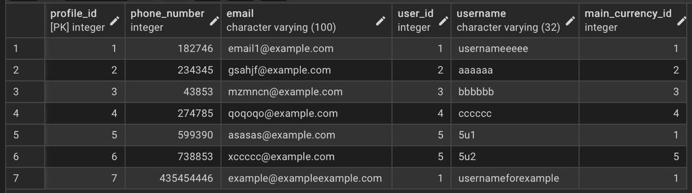

### Додання нового рахунку.
```sql
INSERT INTO Accounts (account_id, account_name, currency_id, profile_id, balance)
VALUES (7,'example account', 1, 1, 9999.97);

SELECT * FROM Accounts
```
### Результат:
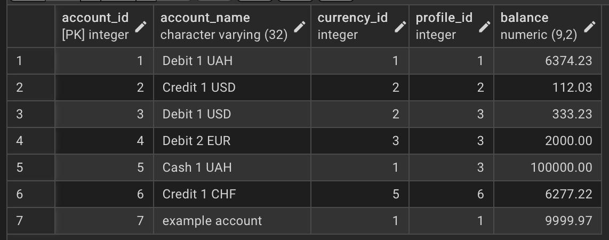

### Додання нового переказу.
```sql
INSERT INTO Transfers (transfer_id, sender_account_id, payee_account_id, amount, fee, transfer_date, transfer_comment)
VALUES (4,1,2,123123.12,123,NOW(),'example');

SELECT * FROM Transfers
```
### Результат:
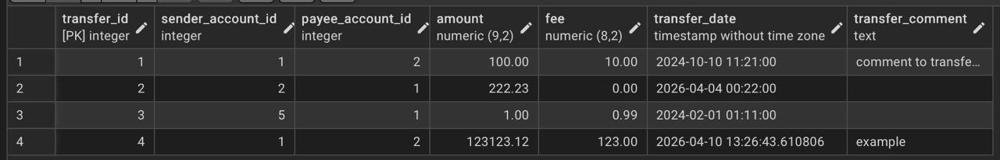

### Додання нового регулярного платежу.
```sql
INSERT INTO RecurringPayments (payment_id, amount, account_id, subcategory_id, "interval", next_payment_date)
VALUES (4, 9992.11, 2, 1, '1 year', '2026-6-6');

SELECT * FROM RecurringPayments
```
### Результат:
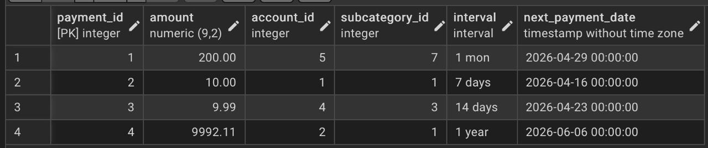

### Додання нової транзакції.
```sql
INSERT INTO Transactions (transaction_id, account_id, subcategory_id, amount, "date", description)
VALUES (4,1,2,2093,NOW(),'example');

SELECT * FROM Transactions
```
### Результат:
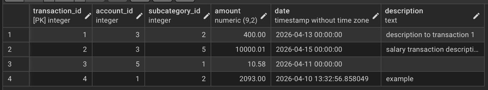

***

### 
```sql

```
### Результат:

