# Лабораторна робота 3: Маніпулювання даними SQL (OLTP)
## Цілі:
1. Написати запити `SELECT` для отримання даних (включаючи фільтрацію за допомогою `WHERE` та вибір певних стовпців).
2. Практикувати використання операторів `INSERT` для додавання нових рядків до таблиць.
3. Практикувати використання оператора `UPDATE` для зміни існуючих рядків (використовуючи `SET` та `WHERE`).
4. Практикувати використання операторів `DELETE` для безпечного видалення рядків (за допомогою `WHERE`).
5. Вивчити основні операції маніпулювання даними (DML) у PostgreSQL та спостерігати за їхнім впливом.
***
## 1. Написати запити `SELECT` для отримання даних (включаючи фільтрацію за допомогою `WHERE` та вибір певних стовпців).
### Отримання логіну та паролю користувачів, що були зареєстровані після 1 січня 2026 року:
```sql
SELECT login, "password" FROM Users WHERE reg_date > '2026-1-1';
```
> Очікування: `login234`, `login2774` та їхні паролі відповідно.
### Результат:


### Вивід кодових назв валют типу `USD`, у яких реальна назва англійською більше 7 літер.
```sql
SELECT code_name FROM Currencies WHERE LENGTH(currency_name) > 7;
```
> Очікування: долар, фунт та франк.
### Результат:


### Вивід категорій, типи яких відносяться до витрат.
```sql
SELECT category_name FROM Categories WHERE category_type = 'Spending';
```
> Очікування: магазини та їжа.
### Результат:


### Вивід підкатегорій, що відносяться до категорії магазину.
```sql
SELECT subcategory_name FROM Subcategories WHERE category_id = 1;
```
> Очікування: Супермаркет, продуктовий та підписка.
### Результат:


### Вивід ідентифікатора, пошти та нікнейма профілів, номер яких кратний 3 і 5, з будь-якою валютою окрім фунтів.
```sql
SELECT user_id, email, username FROM Profiles WHERE phone_number % 3 = 0 AND phone_number % 5 = 0 AND main_currency_id != 4;
```
> Очікування: профіль з ідентифікатором 2.
### Результат:


### Вивід ідентифікаторів та назв рахунків з балансом хочаб 2000 *(без врахування валюти)*.
```sql
SELECT account_id, account_name FROM Accounts WHERE balance >= 2000;
```
> Очікування: id 1, 4, 5, 6.
### Результат:


### Вивід на яку суму та коли були здійснені перекази з яких була стягнута комісія.
```sql
SELECT amount, transfer_date FROM Transfers WHERE fee > 0;
```
> Очікування: на суму 100 та 1.
### Результат:


### Вивід на яку суму оформлені регулярні платежі з інтервалом оплати менше місяця.
```sql
SELECT amount FROM RecurringPayments WHERE "interval" < '1 month';
```
> Очікування: 10 та 9.99.
### Результат:


### Вивід дати коли були виконані транзакції, до яких не було додано опису.
```sql
SELECT "date" FROM Transactions WHERE description != '';
```
> Очікування: 13 та 15 квітня 2026.
### Результат:


***

## 2. Практикувати використання операторів `INSERT` для додавання нових рядків до таблиць.
### Додання нового користувача.
```sql
INSERT INTO Users (user_id, login, "password", reg_date)
VALUES (6, 'newLoginLab3', 'passwordnewinsertion', NOW());

SELECT * FROM Users
```
> Очікування: додання нового користувача.
### Результат:


### Додання нової валюти.
```sql
INSERT INTO Currencies (currency_id, code_name, currency_name)
VALUES (6, 'BTC', 'Bitcoin');

SELECT * FROM Currencies
```
> Очікування: додання нової валюти.
### Результат:


### Додання нової категорії.
```sql
INSERT INTO Categories (category_id, category_name, category_type)
VALUES (4, 'example category', 'Income');

SELECT * FROM Categories
```
> Очікування: додання нової категорії.
### Результат:


### Додання нової підкатегорії.
```sql
INSERT INTO Subcategories (subcategory_id, category_id, subcategory_name)
VALUES (8,2,'example subcategory');

SELECT * FROM Subcategories
```
> Очікування: додання нової підкатегорії.
### Результат:


### Додання нового профілю.
```sql
INSERT INTO Profiles (profile_id, phone_number, email, user_id, username, main_currency_id)
VALUES (7,435454446,'example@exampleexample.com',1,'usernameforexample',1);

SELECT * FROM Profiles
```
> Очікування: додання нового профілю.
### Результат:


### Додання нового рахунку.
```sql
INSERT INTO Accounts (account_id, account_name, currency_id, profile_id, balance)
VALUES (7,'example account', 1, 1, 9999.97);

SELECT * FROM Accounts
```
> Очікування: додання нового рахунку.
### Результат:


### Додання нового переказу.
```sql
INSERT INTO Transfers (transfer_id, sender_account_id, payee_account_id, amount, fee, transfer_date, transfer_comment)
VALUES (4,1,2,123123.12,123,NOW(),'example');

SELECT * FROM Transfers
```
> Очікування: додання нового переказу.
### Результат:


### Додання нового регулярного платежу.
```sql
INSERT INTO RecurringPayments (payment_id, amount, account_id, subcategory_id, "interval", next_payment_date)
VALUES (4, 9992.11, 2, 1, '1 year', '2026-6-6');

SELECT * FROM RecurringPayments
```
> Очікування: додання нового регулярного платежу.
### Результат:


### Додання нової транзакції.
```sql
INSERT INTO Transactions (transaction_id, account_id, subcategory_id, amount, "date", description)
VALUES (4,1,2,2093,NOW(),'example');

SELECT * FROM Transactions
```
> Очікування: додання нової транзакції.
### Результат:


***

## 3. Практикувати використання оператора `UPDATE` для зміни існуючих рядків (використовуючи `SET` та `WHERE`).
### Зміна паролю користувачу.
```sql
UPDATE Users
SET "password" = 'abc123'
WHERE user_id = 2;

SELECT * FROM Users;
```
> Очікування: зміна паролю користувача на abc123.
### Результат:
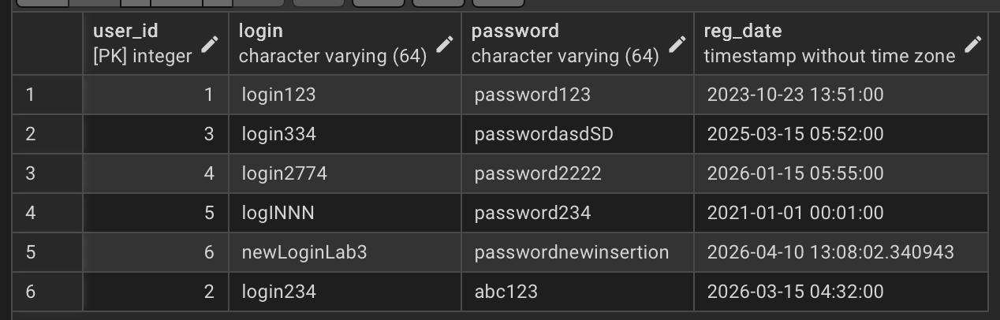

### Зміна кодової назви валюти.
```sql
UPDATE Currencies
SET code_name = 'example'
WHERE currency_id = 6;

SELECT * FROM Currencies;
```
> Очікування: зміна BTC на example.
### Результат:
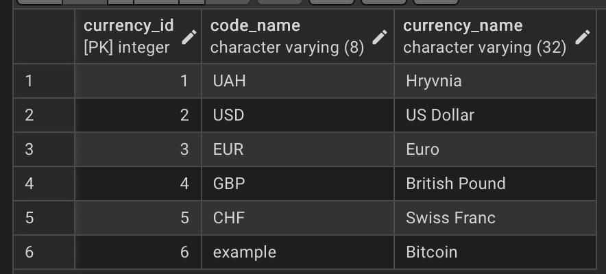

### Зміна типу категорії.
```sql
UPDATE Categories
SET category_type = 'Spending'
WHERE category_id = 4;

SELECT * FROM Categories;
```
> Очікування: Зміна типу категорії з прибутку на витрату.
### Результат:
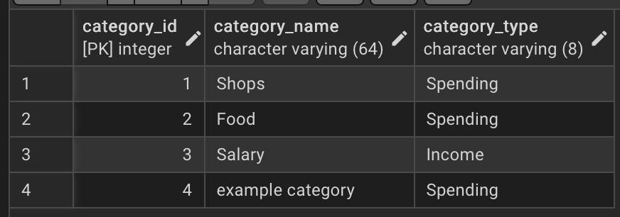

### Зміна видів підкатегорії за категоріями.
```sql
UPDATE Subcategories
SET subcategory_name = 'updateexample'
WHERE category_id = 2;

SELECT * FROM Subcategories;
```
> Очікування: зміна трьох підкатегорій.
### Результат:
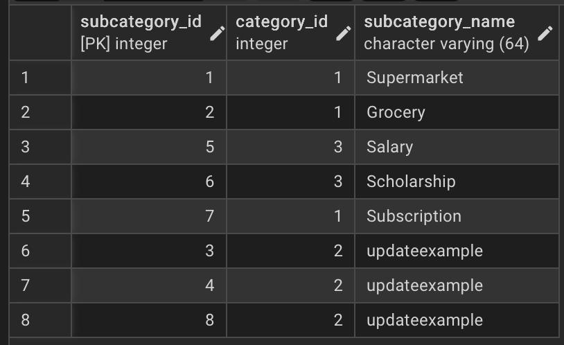

### Зміна пошти профіля.
```sql
UPDATE Profiles
SET email = 'updateexample@email.aaaa'
WHERE profile_id = 4;

SELECT * FROM Profiles;
```
> Очікування: зміна пошти.
### Результат:
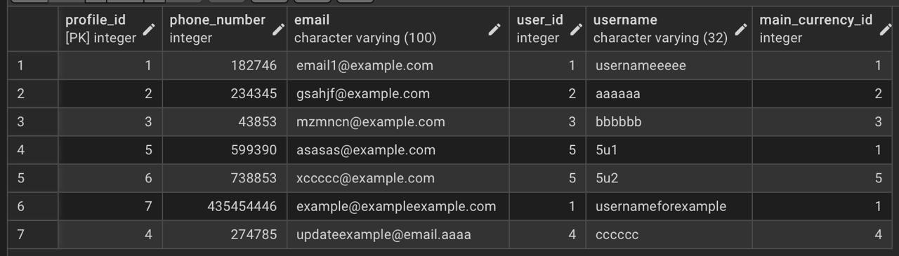

### Зміна балансу рахунку.
```sql
UPDATE Accounts
SET balance = 0
WHERE account_id = 5;

SELECT * FROM Accounts;
```
> Очікування: зміна балансу рахунку на 0.
### Результат:
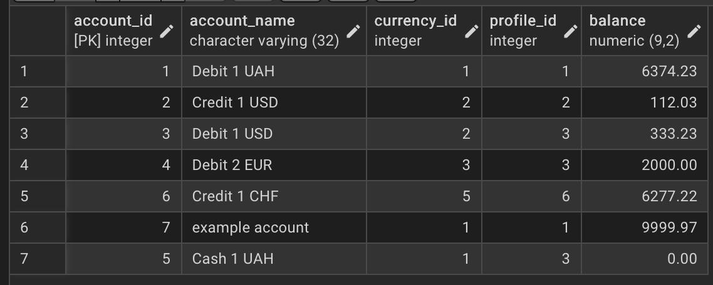

### Зміна коментаря переказу.
```sql
UPDATE Transfers
SET transfer_comment = 'example1'
WHERE transfer_id = 2;

SELECT * FROM Transfers;
```
> Очікування: зміна коментаря переказу.
### Результат:
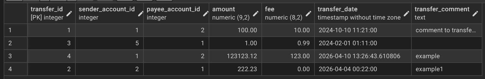

### Зміна інтервалу платежу.
```sql
UPDATE RecurringPayments
SET "interval" = '10 years'
WHERE payment_id = 2;

SELECT * FROM RecurringPayments;
```
> Очікування: зміна інтервалу платежу до 10 років.
### Результат:
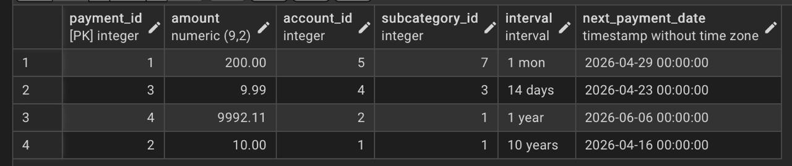

### Зміна опису транзакції.
```sql
UPDATE Transactions
SET description = 'update example description'
WHERE transaction_id = 1;

SELECT * FROM Transactions;
```
> Очікування: зміна опису транзакції.
### Результат:
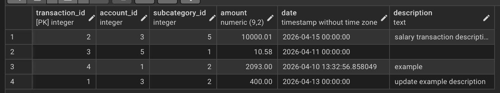

***

## 4. Практикувати використання операторів `DELETE` для безпечного видалення рядків (за допомогою `WHERE`).
### Видалення користувача.
```sql
DELETE FROM Users
WHERE user_id = 6;

SELECT * FROM Users;
```
> Очікування: видалення користувача, що було додано у попередніх завданнях.
### Результат:
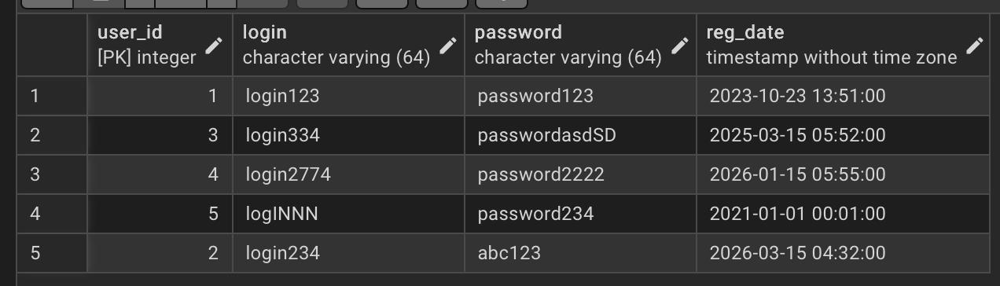

### Видалення валюти.
```sql
DELETE FROM Currencies
WHERE currency_id = 6;

SELECT * FROM Currencies;
```
> Очікування: видалення валюти, що було додано у попередніх завданнях.
### Результат:
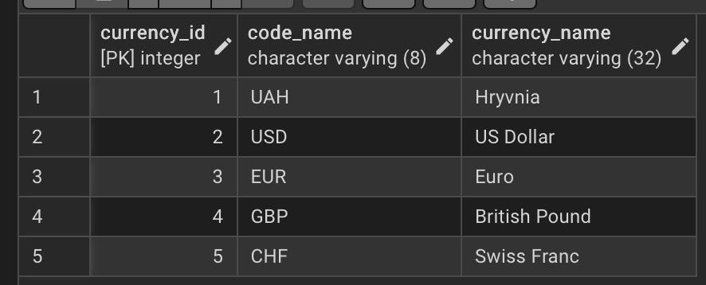

### Видалення категорії
```sql
DELETE FROM Categories
WHERE category_id = 4;

SELECT * FROM Categories;
```
> Очікування: видалення категорії, що було додано у попередніх завданнях.
### Результат:
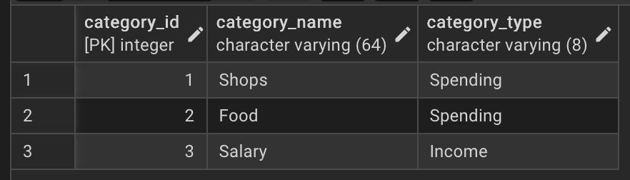

### Видалення підкатегорії.
```sql
DELETE FROM Subcategories
WHERE subcategory_id != 4 AND subcategory_id != 3 AND subcategory_name = 'updateexample';

SELECT * FROM Subcategories;
```
> Очікування: видалення відкатегорії, у якої ідентифікатор не 3 і не 4, але назва updateexample *(що було додано у попередніх завданнях)*.
### Результат:
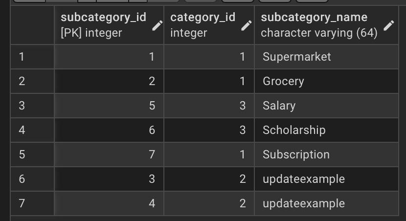

### Видалення профілю.
```sql
DELETE FROM Profiles
WHERE username = 'usernameforexample';

SELECT * FROM Profiles;
```
> Очікування: видалення профілю, з нікнеймом usernameforexample *(що було додано у попередніх завданнях)*.
### Результат:
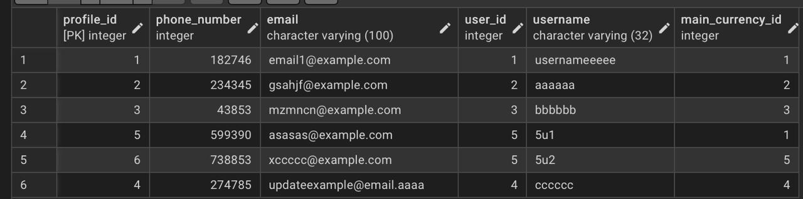

### Видалення рахунку.
```sql
DELETE FROM Accounts
WHERE account_id = 7;

SELECT * FROM Accounts;
```
> Очікування: видалення рахунку, що було додано у попередніх завданнях.
### Результат:
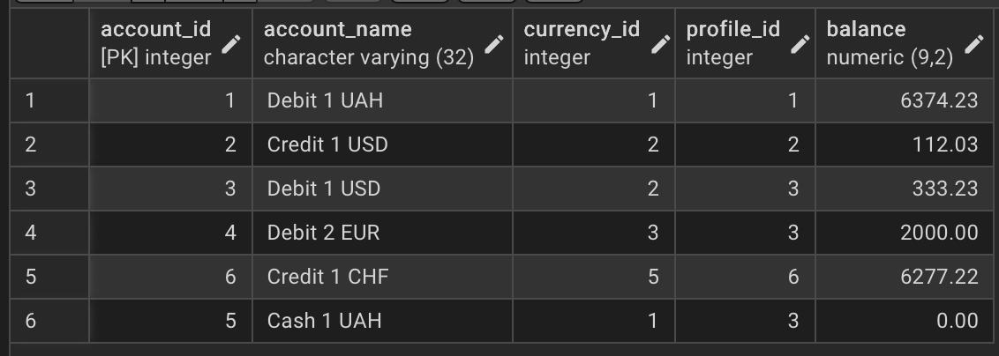

### Видалення переказу.
```sql
DELETE FROM Transfers
WHERE fee = 123;

SELECT * FROM Transfers;
```
> Очікування: видалення переказу, з якого стягнули уомісію у розмірі 123 *(що було додано у попередніх завданнях)*.
### Результат:
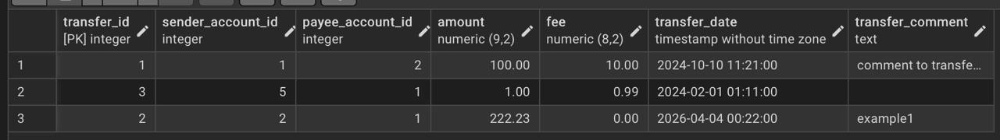

### Видалення регулярного платежу.
```sql
DELETE FROM RecurringPayments
WHERE "interval" = '10 year';

SELECT * FROM RecurringPayments;
```
> Очікування: видалення регулярного платежу, з інтервалом 10 років *(що було додано у попередніх завданнях)*.
### Результат:
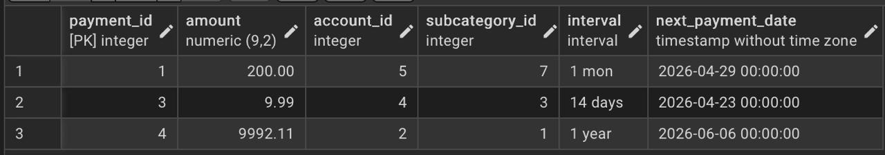

### Видалення транзакції.
```sql
DELETE FROM Transactions
WHERE transaction_id = 4;

SELECT * FROM Transactions;
```
> Очікування: видалення транзакції, що було додано у попередніх завданнях.
### Результат:
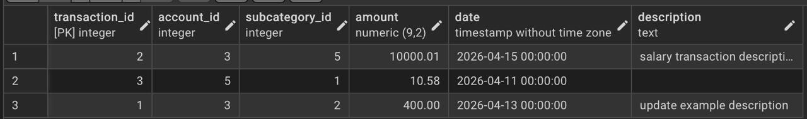

***

## 5. Вивчити основні операції маніпулювання даними (DML) у PostgreSQL та спостерігати за їхнім впливом.
> У результаті лабораторної роботи були вивчені основні операції маніпулювання даними, а саме `SELECT`, `INSERT`, `UPDATE`/`SET` та `DELETE`. Визначили їх вплив на базу даних.
