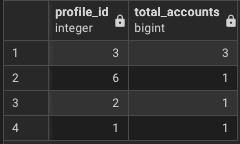
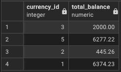
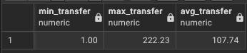
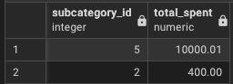
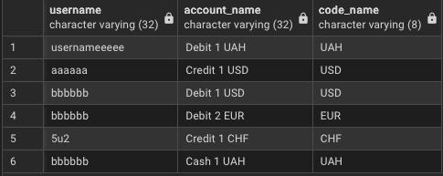
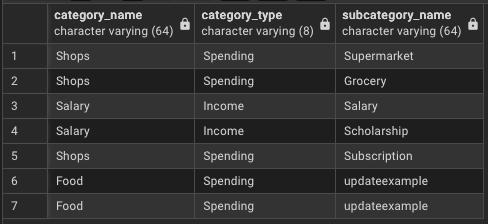
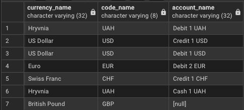
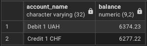
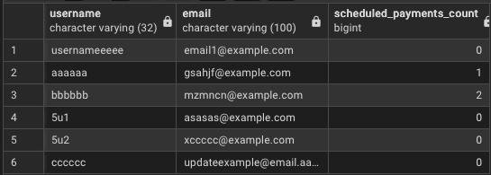
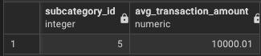

# Лабораторна робота 4: Аналітичні SQL-запити (OLAP)
## Цілі:
1. Використовувати агрегатні функції, такі як COUNT, SUM, AVG, MIN та MAX, для обчислення зведеної статистики з ваших даних.
2. Написати запити GROUP BY для групування рядків за одним або кількома стовпцями та обчислення агрегатів для кожної групи.
3. Використовувати HAVING для фільтрації результатів згрупованих запитів на основі агрегованих умов.
4. Виконувати операції JOIN (принаймні INNER JOIN та LEFT JOIN), щоб об'єднати дані з кількох таблиць.
5. Створювати об'єднані запити на агрегацію для кількох таблиць, які об'єднують таблиці та створюють згрупований, агрегований вивід.
6. Інтерпретувати результати ваших запитів та пояснити, що робить кожен з них.
***
## 1. Використовувати агрегатні функції, такі як COUNT, SUM, AVG, MIN та MAX, для обчислення зведеної статистики з ваших даних. + 2. Написати запити GROUP BY для групування рядків за одним або кількома стовпцями та обчислення агрегатів для кожної групи.
> мінімум 4 запити, що містять агрегаційні функції (SUM, AVG, COUNT, MIN, MAX, GROUP BY)
### Приклад 1 (Кількість рахунків у кожного з користувачів):
```sql
SELECT profile_id, COUNT(account_id) AS total_accounts
FROM accounts GROUP BY profile_id;
```
### Результат:


### Приклад 2 (Загальна сума усіх грошей по валютам):
```sql
SELECT currency_id, SUM(balance) AS total_balance
FROM accounts GROUP BY currency_id;
```
### Результат:


### Приклад 3 (Мінімальний, максимальний та середній показник суми переказів):
```sql
SELECT MIN(amount) AS min_transfer, 
MAX(amount) AS max_transfer, 
ROUND(AVG(amount), 2) AS avg_transfer
FROM transfers;
```
### Результат:


### Приклад 4 (Всього витрачено на підкатегорію, але не менше 100):
```sql
SELECT subcategory_id, SUM(amount) AS total_spent
FROM transactions GROUP BY subcategory_id
HAVING SUM(amount) > 100;
```
### Результат:


***
## 3. Виконувати операції JOIN (принаймні INNER JOIN та LEFT JOIN), щоб об'єднати дані з кількох таблиць.
> мінімум 3 запити, що використовують різні типи джоінів (INNER JOIN, LEFT JOIN, RIGHT JOIN, FULL JOIN, CROSS JOIN)
### Приклад 1 (Вивід офнормації про рахунки по даним профіля та валюти по даним рахунка):
```sql
SELECT p.username, a.account_name, c.code_name
FROM profiles p
INNER JOIN accounts a ON p.profile_id = a.profile_id
INNER JOIN currencies c ON a.currency_id = c.currency_id;
```
### Результат:


### Приклад 2 (Вивід усіх категорій та підкатегорій до них або значення `NULL` за умови, що ні однієї підкатегорії не було додано):
```sql
SELECT c.category_name, c.category_type,s.subcategory_name
FROM categories c
LEFT JOIN subcategories s ON c.category_id = s.category_id;
```
### Результат:


### Приклад 3 (Вивід усіх існуючих валют та рахунків до них або значення `NULL` за умови, що ні одного рахунку не було додано):
```sql
SELECT c.currency_name, c.code_name, a.account_name
FROM accounts a
RIGHT JOIN currencies c ON a.currency_id = c.currency_id;
```
### Результат:


***
## Використання відзапитів.
> мінімум 3 запити з використанням підзапитів (вибірка з підзапитом у SELECT, WHERE, або HAVING)
### Приклад 1 (Вивід усіх рахунків у яких баланс вище середнього):
```sql
SELECT account_name, balance
FROM accounts
WHERE balance > (SELECT AVG(balance) FROM accounts);
```
### Результат:


### Приклад 2 (Вивід користувачів та кількість їхніх регулярних платежів):
```sql
SELECT p.username, p.email, (SELECT COUNT(*) FROM recurringpayments pay
INNER JOIN accounts a ON pay.account_id = a.account_id
WHERE a.profile_id = p.profile_id) AS scheduled_payments_count
FROM profiles p;
```
### Результат:


### Приклад 3 (Вивід підкатегорій, де середня сума транзакцій більше за середню суму усіх транзікцій):
```sql
SELECT subcategory_id, ROUND(AVG(amount), 2) AS avg_transaction_amount
FROM transactions
GROUP BY subcategory_id
HAVING AVG(amount) > (SELECT AVG(amount) FROM transactions);
```
### Результат:

