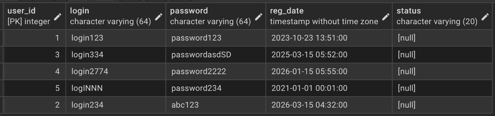
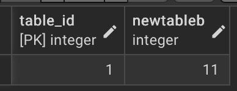
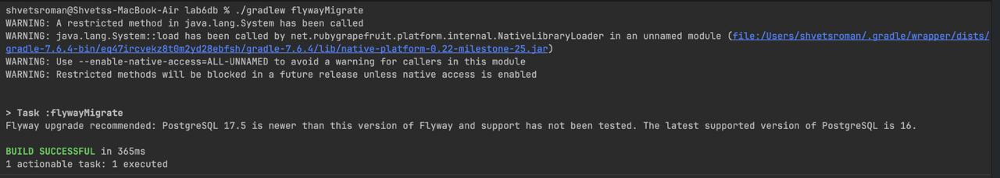

# Лабораторна робота 6: Міграції схем за допомогою Flyway.
## Налаштування проєкту
фів
## Міграції
**1. V1__create_oldpayments_table.sql**
```sql
CREATE TABLE cancelled_payments (
    id SERIAL PRIMARY KEY,
    name VARCHAR(255) NOT NULL,
    reason TEXT NOT NULL,
    cancelled_at TIMESTAMP NOT NULL
);
```
> Дана міграція створює нову таблицю скасованих платежів. Вона містить id платежу, його назву, причину та дату скасування.

**Результат:**


**2. V2__add_status_to_users.sql**
```sql
ALTER TABLE users
ADD COLUMN status VARCHAR(20);
```
> Дана міграція додає стовпець даних про статус облікового запису користувача у таблиці `users`.

**Результат:**


**3. V3__drop_newtablea_column.sql**
```sql
ALTER TABLE newtable
DROP COLUMN newtablea;
```
> Дана міграція видаляє стовпець `newtablea` з таблиці `newtable`.
>
> _Примітка: дана таблиця не має логічного відношення до теми бази та була створена під час очного захисту._

**Результат:**


### Результат запуску міграцій:

